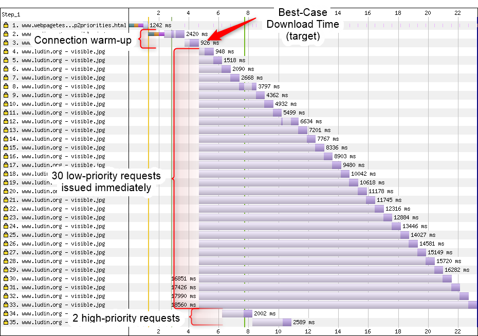
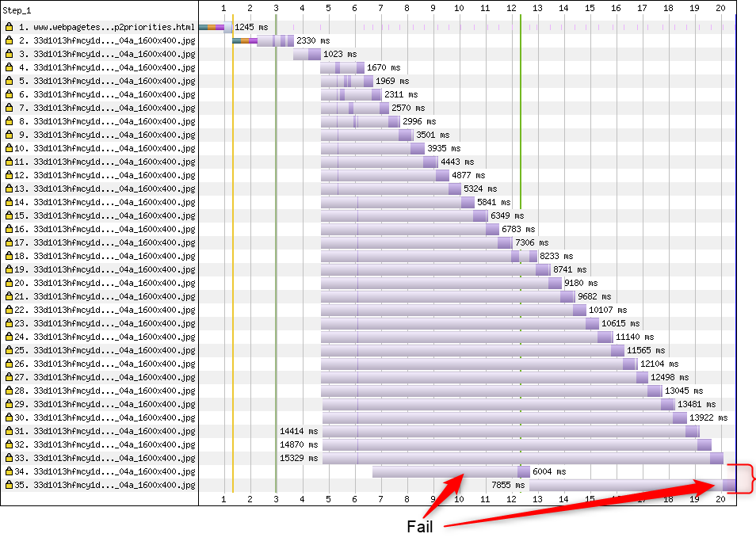
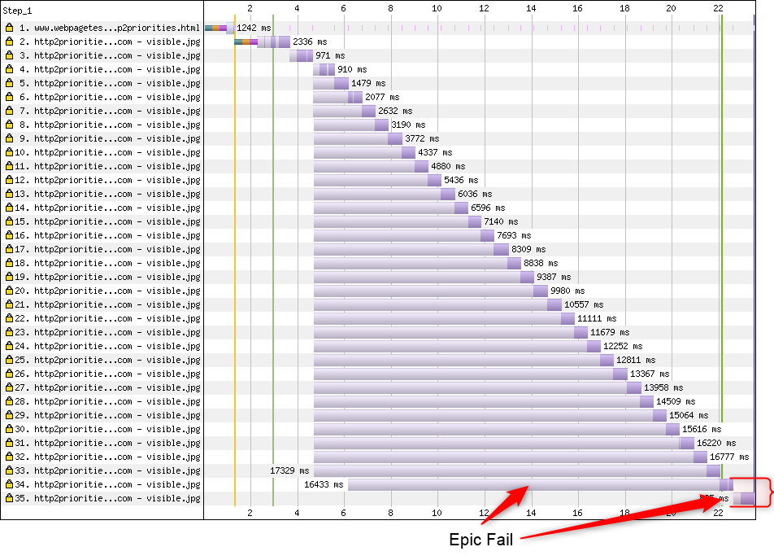

# Stand-alone HTTP/2 prioritization test

An online version of this page is hosted at [https://www.webpagetest.org/http2priorities.html](https://www.webpagetest.org/http2priorities.html) for use when testing.

This is a test page for testing the support for HTTP/2 prioritization on arbitrary hosts. All you need is a single image hosted on the server or service you are trying to test (preferably somewhere close to 100KB in size).

## Recommended test conditions

THe test is designed to work in Chrome and leverages prioritization logic that is specific to Chrome in the testing. It also works best when tested on a low-bandwidth, high-latency connection.

DO NOT use the connection emulation built into Chrome's dev tools. It will not work correctly for testing for network-level prioritization issues.

Using WebPageTest, the recommended configuration is:

* **Location** - Any location with Chrome available (Dulles, VA generally recommended).
* **Browser** - Chrome.
* **Connection** - 3G (1.6 Mbps/768 Kbps, 300ms RTT).
* **Runs** - 3 (or more) to make sure the results are consistent.


## Generating the test URL

You provide the URL for the image to test as an ```image=``` query parameter to the page (make sure to [url-encode](https://meyerweb.com/eric/tools/dencoder/) the URL or the test will not run). The image MUST be hosted over HTTP/2 (or QUIC) otherwise the results of the test will be invalid. The test appends random query strings to the end of the image URL and will only work if the server still returns the image (most do but some like Twitter's image CDN do not).

i.e. Assuming you want to test the system hosting the image:

```text
https://www.perftests.com/http2priorities/resources/visible.jpg
```

You would [url-encode](https://meyerweb.com/eric/tools/dencoder/) the URL to get the encoded version:

```text
https%3A%2F%2Fwww.perftests.com%2Fhttp2priorities%2Fresources%2Fvisible.jpg
```

Then add the query parameter to the test page to get the URL for the [page to test](https://www.webpagetest.org/http2priorities.html?image=https%3A%2F%2Fwww.perftests.com%2Fhttp2priorities%2Fresources%2Fvisible.jpg):

```text
https://www.webpagetest.org/http2priorities.html?image=https%3A%2F%2Fwww.perftests.com%2Fhttp2priorities%2Fresources%2Fvisible.jpg
```

## Interpreting Results

The test will:

* Load the HTML Page (request #1).
* Load the image twice, one at a time (Requests #2 and #3).
  * Establishes a connection to the server and warm up the TCP connection.
  * Each image gets a unique hash appended to the image URL to make sure they are all fetched over the network and not served from cache.
* Request the image 30 times concurrently at a low priority (Requests #4-33).
* Wait for two of the low-priority images to finish loading.
  * This gives the server a chance to fill any output buffers with the image data.
* Request the image at a high priority and wait for it to complete (Request #34)
* Request the image at a high priority (Request #35)

The goal is for the two high-priority requests to complete as soon as possible and as close to the reference time of request #3 as possible.

A passing server will complete both high-priority requests well before the rest of the images complete:



A failing server will take much longer for each of the requests (even if the individual requests don't take the full test time):



The worst-case is when the first high-priority request (Request #34) doesn't return until after all of the low-priority requests have completed:


